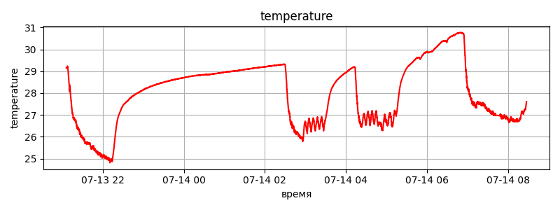
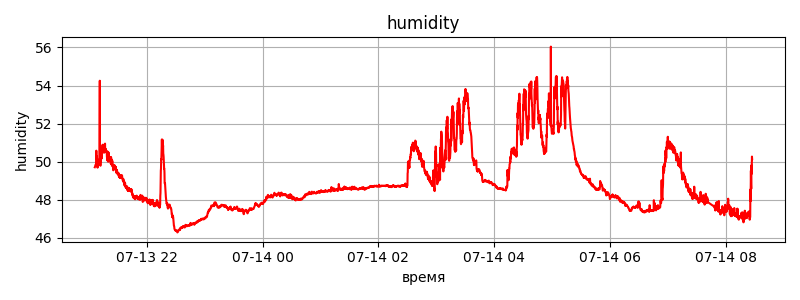
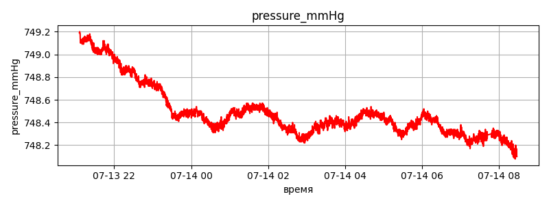
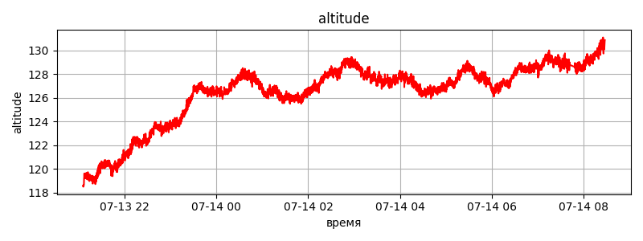

# 🌦️ ESP8266 NodeMCU v3 Meteostation: Полная документация

Документация к проекту метеостанции на базе **ESP8266 NodeMCU v3** с использованием датчика **BME280**. Метеостанция собирает данные о температуре, влажности, давлении и высоте, поддерживает локальный веб-интерфейс и отправку данных на сервер Flask с визуализацией, также включает функцию архивации данных и сброса через кнопку и API.

---

## Описание проекта

Метеостанция на базе **ESP8266 NodeMCU v3** и датчика **BME280** предназначена для мониторинга погодных условий. Она работает в двух режимах:

- **Локальный режим (Local Mode)**: предоставляет веб-интерфейс для настройки и отображения данных.
- **API-режим (API Mode)**: отправляет данные на сервер Flask, где они сохраняются и визуализируются в виде графиков.

Некоторые функции метеостанции:
- **Архивация и сброс данных**: возможность архивировать текущие данные и графики в папку `archives` с последующей очисткой через API-запрос или кнопку на пине D6.
- **Кнопка сброса данных**: подключена к пину D6, позволяет отправить запрос на архивацию и сброс данных на сервере.

---

## ⚙️ Возможности

### ESP8266 NodeMCU
- **Wi-Fi**:
  - Режим точки доступа (AP) с настраиваемым SSID и паролем.
  - Подключение к существующей Wi-Fi сети (STA).
- **Измеряемые параметры**:
  - Температура (°C)
  - Влажность воздуха (%)
  - Давление (гПа и мм рт. ст.)
  - Высота над уровнем моря (м)
- **Настройка**:
  - Веб-интерфейс для выбора режима (локальный или API), настройки Wi-Fi, точки доступа и URL сервера.
  - Сохранение настроек в EEPROM.
- **Кнопки**:
  - Сброс настроек (D7): сбрасывает настройки до значений по умолчанию при удержании во время включения.
  - Сброс данных (D6): отправляет запрос на сервер для архивации и очистки данных.
- **Индикация**: встроенный светодиод мигает при выполнении операций (например, отправка данных, сохранение настроек).

### Flask-сервер
- **Прием данных**: POST-запросы на `/data`.
- **Возврат данных**: GET-запрос на `/data` возвращает последние замеры.
- **Визуализация**: автоматическая генерация графиков в формате PNG:
  - `/plot/temperature.png`
  - `/plot/humidity.png`
  - `/plot/pressure.png`
  - `/plot/pressure_mmHg.png`
  - `/plot/altitude.png`
- **Архивация и сброс**:
  - Endpoint `/change-results` архивирует данные (`data.jsonl`) и графики (`plots`) в папку `archives` с временной меткой, затем очищает текущие данные и графики.

---

## 📋 Требования

### Оборудование
- **ESP8266 NodeMCU v3**
- **Датчик BME280** (I2C, адрес по умолчанию: `0x76`)
- Две кнопки (для сброса настроек и данных)
- USB-кабель для прошивки и питания
- Компьютер или сервер для запуска Flask
- Провода и макетная плата (опционально)

### Программное обеспечение
- **Arduino IDE** с поддержкой ESP8266
- **Библиотеки Arduino**:
  - `Adafruit_BME280`
  - `ESP8266WiFi`
  - `ESP8266WebServer`
  - `EEPROM`
  - `Wire`
  - `ESP8266HTTPClient`
- **Python 3.x**
- **Библиотеки Python**:
  - `flask`
  - `pandas`
  - `matplotlib`
  - `shutil`
- Код проекта:
  - `weather_station.ino` (прошивка ESP8266)
  - `server.py` (Flask-сервер)

---

## 📦 Структура проекта

```
ESP8266_NodeMCU-v3-Meteostation/
├── server.py           # Flask-сервер для обработки данных, графиков и архивации
├── data.jsonl          # История замеров в формате JSON Lines
├── plots/              # Папка для хранения сгенерированных графиков
│   ├── temperature.png # График температуры
│   ├── humidity.png    # График влажности
│   ├── pressure.png    # График давления в гПа
│   ├── pressure_mmHg.png # График давления в мм рт. ст.
│   └── altitude.png    # График высоты
├── archives/           # Папка для архивов данных и графиков
│   ├── archive_YYYY-MM-DD_HH-MM-SS/ # Папка с архивом по временной метке
│   │   ├── data.jsonl               # Архивированный файл данных
│   │   └── plots/                   # Архивированные графики
├── weather_station.ino # Код прошивки для ESP8266
└── README.md           # Документация проекта
```

---

## 🔌 Подключение оборудования

| Пин BME280 | Пин ESP8266 NodeMCU v3 |
|------------|------------------------|
| VIN        | 3V3                   |
| GND        | GND                   |
| SDA        | D2 (GPIO4)            |
| SCL        | D1 (GPIO5)            |


| Кнопка              | Подключение           |
|---------------------|-----------------------|
| Сброс настроек      | D7 (GPIO13) — GND     |
| Сброс данных        | D6 (GPIO12) — GND     |

**Примечание**: Убедитесь, что адрес I2C датчика BME280 — `0x76`. Если адрес отличается (например, `0x77`), измените `#define BME_ADDR` в коде.

---

## 🚀 Установка и настройка

### 1. Подготовка и прошивка ESP8266
1. Подключите датчик BME280 и кнопки к ESP8266 согласно схеме.
2. Установите Arduino IDE и добавьте поддержку плат ESP8266.
3. Установите библиотеки:
   ```bash
   Arduino IDE → Sketch → Include Library → Manage Libraries
   ```
   Установите: `Adafruit_BME280`, `ESP8266WiFi`, `ESP8266WebServer`, `EEPROM`, `Wire`, `ESP8266HTTPClient`.
4. Загрузите файл `weather_station.ino` в Arduino IDE.
5. Подключите ESP8266 через USB и выполните прошивку.

После прошивки устройство создаст точку доступа:
- **SSID**: `Meteostation`
- **Пароль**: `12345678`

6. Подключитесь к точке доступа с телефона или компьютера.
7. Откройте браузер и перейдите по адресу: [http://192.168.4.1](http://192.168.4.1).
8. Настройте параметры:
   - **Режим**: `L` (локальный) или `A` (API).
   - **Wi-Fi SSID и пароль**: для подключения к вашей сети.
   - **AP SSID и пароль**: для настройки точки доступа.
   - **API URL**: адрес сервера (например, `http://192.168.0.129:5000/data`).
9. Нажмите "Сохранить". Устройство перезагрузится.

### 2. Сброс настроек
- Удерживайте кнопку на пине **D7** при включении устройства, чтобы сбросить настройки до значений по умолчанию:
  - Режим: `L` (локальный)
  - AP SSID: `Meteostation`
  - AP Пароль: `12345678`
  - Wi-Fi SSID: `your_SSID`
  - Wi-Fi Пароль: `your_PASSWORD`
  - API URL: `http://192.168.0.129:5000/data`

### 3. Запуск Flask-сервера
1. Установите Python 3.x.
2. Установите зависимости:
   ```bash
   pip install flask pandas matplotlib
   ```
3. Поместите `server.py` в папку проекта.
4. Запустите сервер:
   ```bash
   python server.py
   ```
   Сервер будет доступен по адресу `http://<IP-сервера>:5000`.

---

## 📡 Использование метеостанции

### Локальный режим
1. Подключитесь к точке доступа устройства (по умолчанию `Valkyrja v1 Meteostation`).
2. Откройте [http://192.168.4.1](http://192.168.4.1) для настройки.
3. Перейдите на [http://192.168.4.1/data](http://192.168.4.1/data) для просмотра текущих данных:
   - Температура (°C)
   - Влажность (%)
   - Давление (мм рт. ст. и гПа)
   - Высота (м)

### API-режим
1. Убедитесь, что сервер Flask запущен и доступен.
2. Устройство отправляет данные на сервер каждые 3 секунды через POST-запросы.
3. Доступные endpoint’ы:
   - **POST `/data`**: принимает данные в формате JSON:
     ```json
     {
       "temperature": 24.7,
       "humidity": 45.1,
       "pressure": 1010.2,
       "pressure_mmHg": 757.7,
       "altitude": 128.3
     }
     ```
     Ответ: `{"status": "ok"}`
   - **GET `/data`**: возвращает последние данные:
     ```json
     {
       "temperature": 24.7,
       "humidity": 45.1,
       "pressure": 1010.2,
       "pressure_mmHg": 757.7,
       "altitude": 128.3,
       "timestamp": "2025-07-19T15:57:00"
     }
     ```
   - **GET `/plot/<param>.png`**: возвращает график для параметра (`temperature`, `humidity`, `pressure`, `pressure_mmHg`, `altitude`).
   - **GET `/change-results`**: архивирует данные и графики, затем очищает их. Ответ: `{"status": "archived and reset"}`.

### Сброс данных
- Нажмите кнопку на пине **D6** (подключена с подтяжкой к HIGH), чтобы отправить GET-запрос на `/change-results`. Это:
  1. Сохраняет текущий файл `data.jsonl` и папку `plots` в `archives/archive_YYYY-MM-DD_HH-MM-SS`.
  2. Удаляет текущие `data.jsonl` и папку `plots`.
  3. Создает новую пустую папку `plots`.
- Встроенный светодиод мигает для подтверждения действия.

---

## 🛠️ Новые функции

1. **Архивация и сброс данных**:
   - **На сервере**: Endpoint `/change-results` создает архив с временной меткой в папке `archives` (например, `archives/archive_2025-07-19_15-57-00`). Сюда копируются `data.jsonl` и папка `plots`. После этого текущие данные и графики удаляются, а папка `plots` создается заново.
   - **На устройстве**: Кнопка на пине D6 отправляет запрос на этот endpoint, инициируя архивацию и сброс.

2. **Кнопка сброса данных**:
   - Подключена к пину **D6 (GPIO12)** с подтяжкой к HIGH.
   - При нажатии отправляет GET-запрос на `/change-results`, мигает светодиод для индикации.

---

## 🛠️ Устранение неисправностей

| Проблема                              | Возможная причина                     | Решение                                                                 |
|---------------------------------------|---------------------------------------|-------------------------------------------------------------------------|
| Устройство не создает точку доступа   | Ошибка в прошивке                    | Проверьте код, установите библиотеки, перепрошейте.                     |
| Нет данных от BME280                  | Неправильное подключение или адрес   | Проверьте провода, убедитесь, что адрес I2C — `0x76`.                   |
| Не подключается к Wi-Fi               | Неверный SSID/пароль                 | Настройте через [http://192.168.4.1](http://192.168.4.1).               |
| Сервер не получает данные             | Неверный URL или сервер недоступен   | Проверьте URL, убедитесь, что сервер запущен.                           |
| Графики не обновляются                | Ошибка в `server.py`                 | Убедитесь, что `pandas` и `matplotlib` установлены, проверьте логи.     |
| Архивация не работает                 | Проблемы с правами или папкой        | Проверьте права на запись в папку `archives`, убедитесь, что `shutil` установлен. |
| Кнопка сброса данных не работает      | Неправильное подключение D6          | Проверьте подключение кнопки, убедитесь, что пин настроен как INPUT_PULLUP. |

---

## 📊 Примеры графиков

- **Температура**:  
  
- **Влажность**:  
  
- **Давление (гПа)**:  
  
- **Давление (мм рт. ст.)**:  
  
- **Высота**:  
  

---
